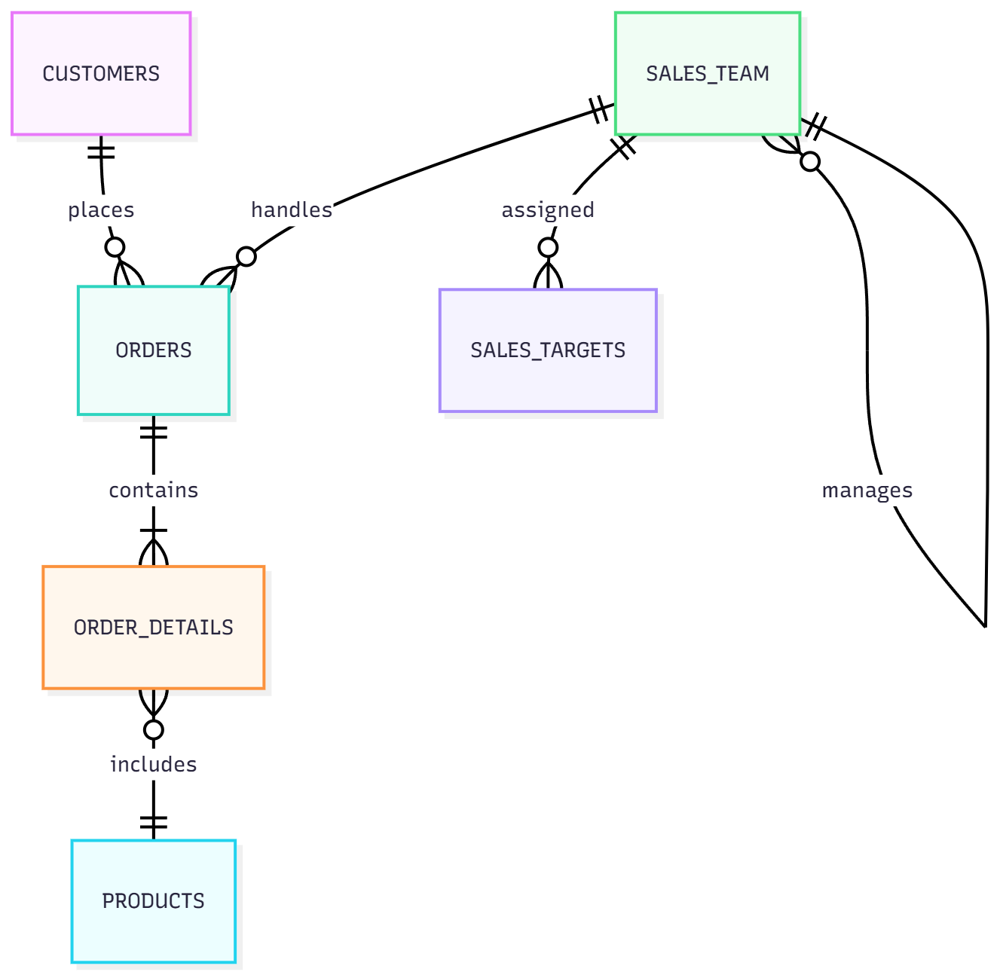

# Sales-Dashboard-Database
<b>Design Document<b>
<b>By Abul Hasan<b>

Video overview: <https://youtu.be/-o-T1Et4cK0>

## Scope

The purpose of this database is to track sales performance, customer interactions, and product sales data to support business statistics and sales team management. As such, included in the database's scope is:

* Customers: Includes basic customer information and industrial segmentation
* Sales_Team: Includes basic team member information and role
* Sales_Targets: Which involves information of targets, time period to acheive them and team member assigned for it.
* Orders: Includes basic information fopr order, its status, payment and to whom it belongs to.
* Order_Details: includes order details with quantity, prices and discounts if any.
* Products: Deals with products informations, its categories/ subcategories and description.

Out of scope are elements like Inventory updates, payroll, hours worked by a team member.

## Functional Requirements

This database will support:

* CRUD operations for team members and customers
* Tracking sales performance by product, region, and sales representative
* Generating sales reports by time periods (daily, monthly, quarterly, yearly)
* Identifying top-performing products and categories
* Calculating sales commissions and bonuses

Beyond scope:
* Real-time inventory updates
* Employee payroll beyond commission calculations

## Representation

### Entities

The database includes the following entities:

#### Customers

The `customers` table includes:

* `customer_id` - INTEGER PRIMARY KEY, unique identifier for each customer
* `company_name` - TEXT NOT NULL, business name for B2B or individual for B2C
* `contact_name` - TEXT, primary contact person
* `email` - TEXT UNIQUE, validated email format
* `phone` - TEXT, contact number = 10 digits
* `address` - TEXT, street address
* `city` - TEXT
* `province` - TEXT, state/province/region
* `postal_code` - TEXT NOT NULL
* `country` - TEXT NOT NULL
* `customer_type` - TEXT CHECK('Enterprise', 'SMB', 'Individual'), segmentation
* `created_date` - DATE DEFAULT CURRENT_DATE
* `status` - TEXT CHECK('Active', 'Inactive') DEFAULT 'Active'

The values which are absolutely necessary are set to defaults and checks are set based on the attributes in `customers`. Data types are based on the real world necessities or values of attributes.

#### SalesTeam

The `sales_team` table includes:

* `sales_rep_id` - INTEGER PRIMARY KEY
* `first_name` - TEXT NOT NULL
* `last_name` - TEXT NOT NULL
* `email` - TEXT NOT NULL UNIQUE
* `phone` - TEXT
* `hire_date` - DATE NOT NULL
* `territory` - TEXT NOT NULL, geographic region
* `manager_id` - INTEGER FOREIGN KEY REFERENCES sales_team(sales_rep_id), self-referencing for hierarchy
* `order_id` - INTEGER FOREIGN KEY REFERENCES
* `base_salary` - NUMERIC(10,2) DEFAULT 0
* `commission_rate` - NUMERIC(5,3) DEFAULT 0.0, commission percentage
* `is_active` - BOOLEAN DEFAULT TRUE

The values which are absolutely necessary are set to NOT NULL and defaults are set based on the attributes in `sales_team`. Data types are based on the real world necessities or values of attributes.

#### Sales_Targets

The `sales_targets` table includes:

* `target_id` - INTEGER PRIMARY KEY
* `sales_rep_id` - INTEGER FOREIGN KEY REFERENCES sales_team(sales_rep_id), NULL for company-wide targets
* `target_period` - TEXT CHECK('Monthly', 'Quarterly', 'Annual') NOT NULL
* `start_date` - DATE NOT NULL
* `end_date` - DATE NOT NULL
* `revenue_target` - NUMERIC(12,2) NOT NULL
* `product_category` - TEXT, NULL for overall targets

The values which are absolutely necessary are set to NOT NULL and defaults are set based on the attributes in `sales_targets`. Applied where a `PRIMARY KEY` or `FOREIGN KEY` constraint was necessary . Data types are based on the real world necessities or values of attributes.

#### Orders

The `orders` table includes:

* `order_id` - INTEGER PRIMARY KEY
* `customer_id` - INTEGER NOT NULL FOREIGN KEY REFERENCES customers(customer_id)
* `sales_rep_id` - INTEGER FOREIGN KEY REFERENCES sales_team(sales_rep_id)
* `order_date` - DATE NOT NULL DEFAULT CURRENT_DATE
* `required_date` - DATE, expected delivery date
* `shipped_date` - DATE, actual shipment date
* `order_status` - TEXT CHECK('Pending', 'Processing', 'Shipped', 'Delivered', 'Cancelled') DEFAULT 'Pending'
* `payment_method` - TEXT CHECK('Credit Card', 'Bank Transfer', 'Cash', 'Other')
* `payment_status` - TEXT CHECK('Pending', 'Completed', 'Failed', 'Refunded') DEFAULT 'Pending'

Assigned primary and foreign keys where required to connect the entities. Attributes that required a checks and defaults were implemented. CURRENT_DATE was used for order placement as default in `orders`.

#### OrderDetails

The `order_details` table includes:

* `order_detail_id` - INTEGER PRIMARY KEY
* `order_id` - INTEGER NOT NULL FOREIGN KEY REFERENCES orders(order_id)
* `product_id` - INTEGER NOT NULL FOREIGN KEY REFERENCES products(product_id)
* `quantity` - INTEGER NOT NULL CHECK(quantity > 0)
* `unit_price` - NUMERIC(10,2) NOT NULL CHECK(unit_price >= 0)
* `discount` - NUMERIC(4,2) DEFAULT 0.0 CHECK(discount BETWEEN 0 AND 100)

All columns in the `order_details` table are required, and hence should have the `NOT NULL` constraint applied. Other constraints are necessary like checking the numerals are in range. Assigned primary and foreign keys where required to connect the entities.

#### Products

The `products` table includes:

* `product_id` - INTEGER PRIMARY KEY
* `product_name` - TEXT NOT NULL
* `category` - TEXT NOT NULL, product classification
* `subcategory` - TEXT, more specific classification if required
* `unit_price` - NUMERIC(10,2) NOT NULL CHECK(`unit_price` > 0)
* `cost_price` - NUMERIC(10,2) NOT NULL, for margin calculation
* `description` - TEXT, product details
* `is_active` - BOOLEAN DEFAULT TRUE, for product lifecycle

TEXT data type for descriptions. BOOLEAN for finding active or in stock products. NUMERIC wherever needed.

### Relationships

The below entity relationship diagram describes the relationships among the entities in the database.

#### Relationship descriptions:

* One customer can place zero or many orders, but each order belongs to exactly one customer.
* One sales representative can handle many orders, but each order is assigned to one sales rep (or potentially unassigned).
* One memeber of team manages zero or many members, but each member is managed by exactly one member
* Sales representatives can have zero or multiple sales targets over time, and exactly one target can be set for one sales representative.
* One order contains one or many order details, each detail line belongs to one order.
* One product can appear in zero or many order details, each order detail references one product.

## Optimizations

Indexes created for performance:

* `idx_orders_date` on `orders`('order_date') - for time-based sales analysis
* `idx_orders_customer` on `orders`('customer_id') - for customer purchase history
* `idx_orders_rep` on `orders`('sales_rep_id') - for sales team performance
* `idx_products_category` on `products`('category') - for product category analysis
* `idx_customers_region` on `customers`('country', 'state') - for geographic analysis
* `idx_order_details_product` on `order_details`('product_id') - for product performance

Views created for common reporting:

* `monthly_sales_summary` - aggregates sales by month, product category, and region
* `sales_team_performance` - calculates performance metrics for each sales representative
* `customer_lifetime_value` - computes customer value and purchase patterns
* `product_performance` - shows sales and margin by product

## Limitations

The current schema has no support for returned items and refund processing, limited support for seasonal or promotional pricing strategies, inventory needs can be bulilt further and improved.
